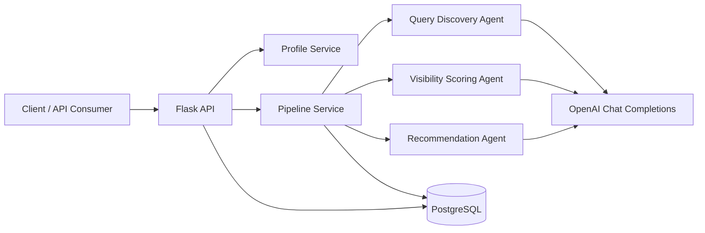

# AI Visibility API

AI Visibility API is a Flask + PostgreSQL service that helps a business understand how visible it is in AI-generated search answers. It discovers AI-style queries, estimates visibility opportunities, and recommends content that can improve future brand presence in AI answers.

## Overview

The project combines:
- a Flask REST API for profiles, queries, pipelines, and recommendations
- a PostgreSQL database for persistence
- an OpenAI-backed LLM service for query discovery, visibility scoring, and content recommendations
- Docker Compose for one-command local startup

The main workflow is:
1. Create a business profile.
2. Run the pipeline for that profile.
3. Review discovered AI-style queries and their opportunity scores.
4. Fetch recommendations for improving AI visibility.

## Architecture



## Key Features

- Create and manage business profiles
- Discover AI-search style queries for a brand or domain
- Score visibility opportunities using a weighted formula
- Generate practical content recommendations
- Run the full experience with a single Make command

## Tech Stack

- Python 3.12
- Flask 3.1.1
- Flask-SQLAlchemy 3.1.1
- Flask-Migrate 4.1.0
- PostgreSQL 16
- OpenAI Python SDK
- Docker Compose + Gunicorn

## Prerequisites

Before running the project locally, make sure you have:
- Docker and Docker Compose installed
- Python 3.12 (optional, only for local non-container development)
- An OpenAI API key

## Quick Start

1. Copy the example environment file and fill in the real values:
   ```sh
   cp .env.example .env
   ```

2. Edit `.env` and set at least:
   - `OPENAI_API_KEY=your_real_openai_key`
   - `OPENAI_MODEL=gpt-4o-mini` (or another supported model)
   - `POSTGRES_*` values if you want to customize the database

3. Start everything with the project’s single Make command:
   ```sh
   make up-d
   ```

   This will build the containers and start the app in the background.

4. Open the API locally at:
   - http://localhost:5000

5. Useful commands:
   ```sh
   make logs
   make down
   make test
   ```

## Environment Variables

The app reads environment variables from `.env` through `python-dotenv`.

Required for the LLM path:
- `OPENAI_API_KEY`: your OpenAI secret key
- `OPENAI_MODEL`: model name to use (default: `gpt-4o-mini`)

Database and app variables:
- `APP_PORT`: application port (default `5000`)
- `DATABASE_URL`: PostgreSQL connection string used by Flask
- `POSTGRES_DB`, `POSTGRES_USER`, `POSTGRES_PASSWORD`, `POSTGRES_PORT`
- `SECRET_KEY`: Flask secret key

## API Overview

Base path: `/api/v1`

### Profiles
- `POST /api/v1/profiles` — create a business profile
- `GET /api/v1/profiles/<profile_uuid>` — get a profile and summary

### Pipeline
- `POST /api/v1/profiles/<profile_uuid>/run` — run the discovery + scoring + recommendation pipeline

### Queries
- `GET /api/v1/queries/profiles/<profile_uuid>` — list discovered queries
- `POST /api/v1/queries/<query_uuid>/recheck` — re-score a query

### Recommendations
- `GET /api/v1/recommendations/profiles/<profile_uuid>` — list recommendations

## Example curl Commands

Replace `PROFILE_UUID` and `QUERY_UUID` with values returned by the API.

### 1. Create a profile
```sh
curl -X POST http://localhost:5000/api/v1/profiles \
  -H "Content-Type: application/json" \
  -d '{
    "name": "Acme AI Tools",
    "domain": "https://acme.example",
    "industry": "SaaS",
    "description": "AI workflow platform for teams",
    "competitors": ["Competitor A", "Competitor B"]
  }'
```

### 2. Get a profile
```sh
curl http://localhost:5000/api/v1/profiles/PROFILE_UUID
```

### 3. Run the pipeline for a profile
```sh
curl -X POST http://localhost:5000/api/v1/profiles/PROFILE_UUID/run
```

### 4. List queries for a profile
```sh
curl "http://localhost:5000/api/v1/queries/profiles/PROFILE_UUID?page=1&per_page=10"
```

### 5. Recheck a specific query
```sh
curl -X POST http://localhost:5000/api/v1/queries/QUERY_UUID/recheck
```

### 6. List recommendations for a profile
```sh
curl http://localhost:5000/api/v1/recommendations/profiles/PROFILE_UUID
```

## Real OpenAI Integration

The actual LLM integration lives in `app/services/llm.py`.

It uses the OpenAI Python SDK to call `chat.completions.create(...)` with:
- the selected model from `OPENAI_MODEL`
- a system prompt specific to the task
- a JSON schema response format for reliable parsing

The result is parsed with `json.loads(...)` and returned to the agent layer. This is the real path used by the discovery, scoring, and recommendation flows.

## Scoring Formula

The opportunity score is calculated in `app/utils/scoring.py`.

The score is a weighted value from 0 to 1:

$$
score = 0.35 \cdot volumeScore + 0.25 \cdot difficultyScore + 0.25 \cdot visibilityGapScore + 0.15 \cdot commercialIntent
$$

Where:
- `volumeScore = min(search_volume / 2000, 1.0)`
  - rewards queries with higher expected search demand
- `difficultyScore = 1 - min(difficulty / 100, 1.0)`
  - rewards easier-to-win opportunities
- `visibilityGapScore = 0` if the brand is visible, otherwise `1`
  - penalizes opportunities where the brand is not currently visible in AI answers
- `commercialIntent` is a normalized value between 0 and 1
  - rewards commercial and conversion-oriented queries

Why these weights?
- Demand and commercial value matter most, so volume and commercial intent carry the largest influence.
- Difficulty is important, but the model should not over-reward hard terms.
- Visibility gap is a strong signal because the biggest opportunity often comes from being absent in AI answers.

## Project Structure

- `app/api/` — Flask route handlers
- `app/services/` — business logic and LLM orchestration
- `app/agents/` — discovery, scoring, and recommendation agents
- `app/models/` — SQLAlchemy models
- `app/schemas/` — request and response validation
- `app/utils/` — scoring and shared utilities
- `migrations/` — Alembic database migrations

## Development Notes

- The app runs in Docker by default through `make up-d`.
- The database is created automatically during the container startup path.
- When you need to inspect logs, use `make logs`.
- When you need to stop the stack, use `make down`.

## Troubleshooting

If the API fails to start:
1. Confirm `.env` exists and contains a valid `OPENAI_API_KEY`.
2. Confirm Docker is running.
3. Rebuild the stack with:
   ```sh
   make build
   make up-d
   ```

If the LLM call fails:
- check that `OPENAI_API_KEY` is not empty
- verify the model name in `OPENAI_MODEL`
- inspect container logs with `make logs`
